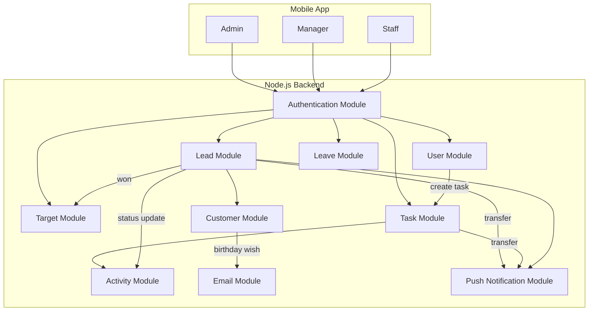

# 📇 CRM Backend System – Architecture & Features

This document outlines the backend architecture and business logic of a **CRM (Customer Relationship Management)** system designed to manage leads, customers, and employee activities, all within a role-based mobile application.

---

## 🧩 System Overview



- **Platform**: Mobile Application (single app for Admin, Manager, Staff)
- **Architecture**: A monolithic Node.js backend, organized in a modular, feature-based structure, with separate route and controller files for each domain (leads, tasks, customers, etc.).
---

## 👥 User Roles & Permissions

### Admin
- Access to **all leads**, **all activity**, **all customer data**
- Can **transfer** leads to any user
- Can **assign monthly targets** to managers
- Can **view and approve leave requests**
- Can **download customer data as Excel**
- Receives **push notifications** for all transfers/tasks
- Can **search** leads, users, customers globally

### Manager
- Can see **their own leads** and **leads of their staff**
- Can **transfer** leads to other managers or staff
- Can assign **monthly targets** to staff
- Can view **all activity** related to a lead, or globally
- Can **create tasks**, update lead status, etc.
- Receives push notifications when assigned leads or tasks

### Staff
- Can only see **leads they created or assigned to**
- Can **transfer** leads to their manager or other staff in same group
- Can update status, create tasks, etc. (recorded as activity)
- Can **submit leave requests** to admin
- Receives push notifications for assigned tasks or lead transfers

---

## 📁 Modules and Features

### 🔑 Authentication Service
- Role-based login (Admin, Manager, Staff)
- JWT/OAuth authentication
- Middleware enriches request with role-based privileges

### 👤 User Service
- Role & hierarchy management
- Staff linked to Manager
- Target assignment tracking

### 📋 Lead Service
- CRUD for leads
- Pagination and search support
- Transfers restricted based on hierarchy
- Auto-log each update as an **activity**

### 🧭 Target Service
- Admin assigns targets to Managers
- Managers assign targets to Staffs
- Monthly breakdown of:
  - Assigned Target
  - Achieved Target (based on leads with status "Won")
- Automatically filters and calculates by role

### 🗂️ Customer Service
- Separate from leads
- Avoids duplication via unique checks (email/phone)
- Admin can export as Excel

### 🛠️ Activity Service
- Every event logs a new activity:
  - Lead transfer
  - Status update
  - Task creation
- Accessible to users based on lead visibility

### 📧 Email Service
- Sends **birthday wishes** using Gmail API (OAuth)
- Daily cron job checks for upcoming birthdays

### 📆 Task & Leave Service
- Tasks can be assigned to staff by managers/admin
- Leave requests submitted by staff → viewed & approved by Admin
- Each action creates a new **activity**

### 🔔 Push Notification Service
- Uses Firebase Cloud Messaging (FCM)
- Sent for:
  - Lead transfer
  - Task assignment

---

## 🔁 Shared API Design

The backend uses **shared routes** for similar operations, such as:
- `GET /leads`
- `POST /leads`
- `POST /transfer`
- `GET /activity`
- `POST /target`

### Role-Based Logic
Each request is filtered and controlled by middleware that attaches the user’s **role and scope**:
```js
req.user = {
  id: "user_id",
  privilege: "admin" | "manager" | "staff",
}

